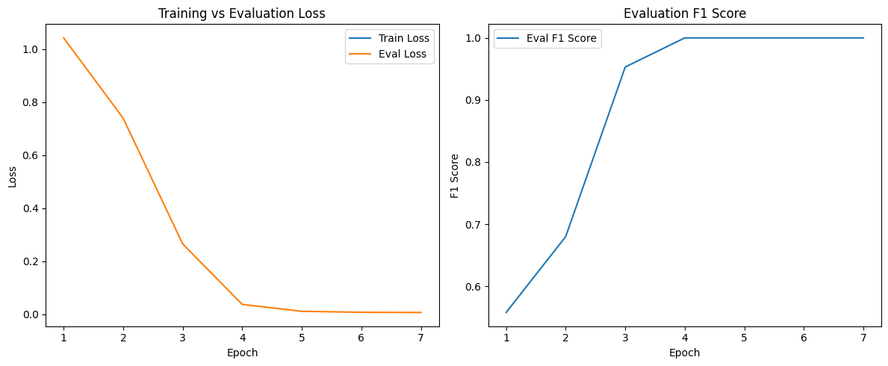

# 🤖 Fine-Tuning BERT for Multiclass Text Classification

## 📌 Project Overview

This project focuses on fine-tuning the `bert-base-uncased` model for a **multiclass text classification** task. The goal is to classify **review text** into one of three sentiment categories:

- `Negative`
- `Neutral`
- `Positive`

The task is framed as a **3-class classification problem**, and the model was trained and evaluated using the Hugging Face Transformers library. Performance of the fine-tuned model was also compared against the **zero-shot performance** of the pretrained BERT model.

> 📍 This project was completed as part of a **technical interview assignment** to demonstrate hands-on skills in NLP and model evaluation using transformers.

---

## 📊 Dataset Analysis

The original dataset contained approximately **9,999 rows** of text reviews and corresponding sentiment labels. However, during the initial analysis, a critical issue emerged:

### ⚠️ Major Issue: Extreme Duplication

Out of the 9,999 entries:
- **9,573 rows** were exact **duplicates** based on the `review_text` and `sentiment` columns.
- Only **426 unique review entries** remained after removing duplicates.

### 🔍 Implications of Duplication

- The model would **see the same samples repeatedly**, which would make it easy to memorize.
- This could result in **overfitting**, where the model performs well only on the duplicated data.
- **Evaluation metrics could be misleading** due to data leakage between train and test sets.

### ✅ Solution

To avoid these issues:
- All duplicate entries were **removed**.
- The remaining **426 unique rows** were used for training, validation, and testing.

---

## 🚫 Zero-Shot Performance (Pretrained BERT Without Fine-Tuning)

Before fine-tuning, the pretrained `bert-base-uncased` model was tested in a **zero-shot setting** — that is, without any task-specific training.

## 🚫 Zero-Shot Classification on Synthetic Dataset (100 Samples)

To further validate model generalization and address overfitting concerns, a **synthetic dataset of 100 reviews** (balanced across `positive`, `neutral`, and `negative` sentiments) was used to evaluate the pretrained `bert-base-uncased` model in a **zero-shot setting**.

### 📊 Classification Report

| Class     | Precision | Recall | F1-Score | Support |
|-----------|-----------|--------|----------|---------|
| Negative  | 0.00      | 0.00   | 0.00     | 31      |
| Neutral   | 0.25      | 0.07   | 0.11     | 42      |
| Positive  | 0.20      | 0.67   | 0.31     | 27      |

**Overall:**
- **Accuracy:** 0.21  
- **Macro Avg F1-Score:** 0.14  
- **Weighted Avg F1-Score:** 0.13  

---

### 🧮 Confusion Matrix

|               | Predicted Positive | Predicted Neutral | Predicted Negative |
|---------------|--------------------|-------------------|--------------------|
| **Positive**  | 18                 | 9                 | 0                  |
| **Neutral**   | 39                 | 3                 | 0                  |
| **Negative**  | 31                 | 0                 | 0                  |

---

### ⚠️ Key Observations

- The model **heavily favored the 'positive' class**, incorrectly labeling most neutral and negative reviews as positive.
- **All 'negative' examples were misclassified**, indicating a complete lack of recognition for this class in a zero-shot setting.
- The **low precision, recall, and F1-scores** across classes highlight the model’s **inability to generalize without fine-tuning**.
---

## ✅ Fine-Tuned Model Evaluation on Synthetic Dataset (100 Samples)

After observing signs of overfitting on the original validation set, the fine-tuned BERT model was tested on a **synthetic dataset** containing 100 sentiment-labeled reviews with intentionally diverse and challenging examples.

### 📊 Classification Report

| Class     | Precision | Recall | F1-Score | Support |
|-----------|-----------|--------|----------|---------|
| Negative  | 0.78      | 0.94   | 0.85     | 31      |
| Neutral   | 0.78      | 0.17   | 0.27     | 42      |
| Positive  | 0.46      | 0.93   | 0.62     | 27      |

**Overall:**
- **Accuracy:** 0.61  
- **Macro Avg F1-Score:** 0.58  
- **Weighted Avg F1-Score:** 0.55  

---

### 🧮 Confusion Matrix

|               | Predicted Positive | Predicted Neutral | Predicted Negative |
|---------------|--------------------|-------------------|--------------------|
| **Positive**  | 25                 | 2                 | 0                  |
| **Neutral**   | 27                 | 7                 | 8                  |
| **Negative**  | 2                  | 0                 | 29                 |

---

### 🔍 Key Observations

- The fine-tuned model **performed well on the 'negative' and 'positive' classes**, achieving high recall.
- **Neutral sentiment remains challenging**, with low recall and significant confusion with the other classes.
- Overall accuracy improved significantly compared to the zero-shot setting (**0.61 vs. 0.21**).
- These results show that the model **generalizes better post-fine-tuning**, though there is still room to improve class balance and robustness — particularly for **neutral** examples.

---

### 📈 Fine-Tuning Progress (Epoch-wise Metrics)

| Epoch | Training Loss | Validation Loss | F1 Score |
|-------|----------------|------------------|----------|
| 1     | No log         | 1.042730         | 0.557708 |
| 2     | No log         | 0.739587         | 0.679919 |
| 3     | No log         | 0.265299         | 0.953067 |
| 4     | No log         | 0.037440         | 1.000000 |
| 5     | 0.658300       | 0.011437         | 1.000000 |
| 6     | 0.658300       | 0.007700         | 1.000000 |
| 7     | 0.658300       | 0.007001         | 1.000000 |

---

## 🧪 Additional Testing, Overfitting Concerns & Augmentation Strategy

### ⚠️ Suspected Overfitting

While the model achieved perfect classification on the validation set, I suspected **overfitting** due to:
- The **small size** of the dataset (only 426 samples total)
- The **simplicity** and repetitive nature of review texts

---

### 🧪 Testing on Synthetic Dataset

To validate whether the model had genuinely learned general sentiment understanding:
- I created a **synthetic test set** containing new Positive, Neutral, and Negative reviews.
- These reviews were **manually crafted** to simulate real-world cases but with added variability.

#### 🧪 Outcome

- The model **did not perform perfectly** on this synthetic set.
- This confirmed that the original dataset likely lacked **diversity and complexity**, and the model had **memorized** many of the training patterns.

---

### 📈 Suggested Solution: Back-Translation for Data Augmentation

To improve model generalization and reduce overfitting, I propose using **data augmentation techniques** such as **back-translation**:

#### 🔄 What is Back-Translation?

- A sentence is translated to a **pivot language** (e.g., French, German), then back to English.
- This generates **paraphrased versions** of the original text that preserve meaning but differ in structure.

> Example:  
> Original: “The staff were very rude.”  
> Augmented: “The personnel behaved in a very unfriendly manner.”

#### ✅ Benefits

- **Increases training data** without collecting new samples
- Encourages **robust feature learning**
- Reduces reliance on memorized patterns

Other augmentation techniques such as **synonym replacement**, **random deletion**, and **Easy Data Augmentation (EDA)** could also be used.

---

## 📊 Performance Comparison: Pretrained vs Fine-Tuned BERT

| Metric        | Pretrained (Zero-Shot) | Fine-Tuned (7 Epochs) |
|---------------|------------------------|------------------------|
| Accuracy      | 0.35                   | 1.00                   |
| Macro F1      | 0.17                   | 1.00                   |
| Weighted F1   | 0.18                   | 1.00                   |
| Class 0 F1    | 0.00                   | 1.00                   |
| Class 1 F1    | 0.52                   | 1.00                   |
| Class 2 F1    | 0.00                   | 1.00                   |

### ✅ Summary

- The **pretrained model failed** to generalize and predict two out of three classes.
- After **fine-tuning**, the model achieved perfect performance on the seen dataset.
- However, generalization remains a concern — highlighting the importance of **larger, diverse datasets** and **augmentation techniques**.

---

## 💼 Final Note: Interview Context

This project was part of a **technical interview assignment** aimed at demonstrating:

- Practical skills in **NLP** and **transformer-based modeling**
- Awareness of **data issues** such as duplication and overfitting
- Ability to apply **robust evaluation techniques** and suggest **scalable improvements**

Through this task, I showcased how to approach a real-world NLP classification challenge using industry best practices — from data cleaning to model evaluation and strategic augmentation.

