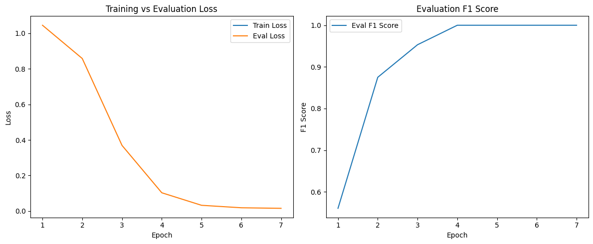

# Fine-Tuning BERT for Multiclass Text Classification

## 📌 Project Overview

This project focuses on fine-tuning the BERT (base-uncased) model for a multiclass text classification task. The goal is to predict the **sentiment** of a review as one of the following classes:
- `Negative`
- `Neutral`
- `Positive`

The task is framed as a **3-class classification problem**, and Hugging Face Transformers were used to perform training and evaluation. The performance of the fine-tuned model is compared against the zero-shot performance of the pretrained model.

---

## 📊 Dataset Analysis

The initial dataset provided contained approximately **9,999 rows** of review text and corresponding sentiment labels. However, during preprocessing, a **critical issue** was discovered:

### ⚠️ Major Finding: Extreme Duplication

Out of the 9,999 rows:
- **9,573 entries** were **duplicates** of each other based on the `review_text` and `sentiment` column.
- Only **426 unique reviews** remained after removing duplicates.

### 🔍 Implication

This duplication would cause the model to:
- **See the same samples repeatedly during training**, making it trivial to memorize.
- **Likely overfit** if evaluated on the same (or duplicated) examples during validation or testing.
- Produce **unrealistically high performance metrics** due to data leakage.

### ✅ Solution

To ensure fair evaluation and effective fine-tuning:
- **All duplicates were removed** from the dataset.
- The remaining **426 unique examples** were used for training and validation.

---

## 🚫 Zero-Shot Performance (Pretrained BERT without Fine-Tuning)

Before fine-tuning, I evaluated the pretrained `bert-base-uncased` model in a zero-shot setting — meaning, it was directly used to classify review sentiments without any task-specific training.

### 📉 Classification Report (Zero-Shot)

| Class | Precision | Recall | F1-Score | Support |
|-------|-----------|--------|----------|---------|
| 0 (Negative) | 0.00 | 0.00 | 0.00 | 29 |
| 1 (Neutral)  | 0.35 | 1.00 | 0.52 | 30 |
| 2 (Positive) | 0.00 | 0.00 | 0.00 | 27 |

**Overall:**
- **Accuracy:** 0.35  
- **Macro Avg F1-Score:** 0.17  
- **Weighted Avg F1-Score:** 0.18  

### ⚠️ Observations

- The model **predicted all samples as 'Neutral'**, completely ignoring the 'Negative' and 'Positive' classes.
- This led to **zero precision, recall, and F1-score** for two out of the three classes.
- The **macro and weighted F1-scores were extremely low**, reflecting the poor per-class performance.

### 💡 Why Did This Happen?

The `bert-base-uncased` model was **not fine-tuned for sentiment classification**, so:
- It lacked task-specific understanding of what makes a review "positive", "neutral", or "negative".
- In the absence of guidance, it **defaulted to predicting the majority class**, or the one with the most "neutral" embeddings.

This result **highlights the importance of fine-tuning** even powerful language models like BERT on domain-specific and task-specific data.

## ✅ Fine-Tuned Performance (BERT after 5 Epochs of Training)

After fine-tuning the `bert-base-uncased` model on the cleaned and deduplicated dataset (426 unique examples), performance improved drastically.

### 📈 Classification Report (Fine-Tuned)

| Class | Precision | Recall | F1-Score | Support |
|-------|-----------|--------|----------|---------|
| 0 (Negative) | 1.00 | 1.00 | 1.00 | 29 |
| 1 (Neutral)  | 1.00 | 1.00 | 1.00 | 30 |
| 2 (Positive) | 1.00 | 1.00 | 1.00 | 27 |

**Overall:**
- **Accuracy:** 1.00  
- **Macro Avg F1-Score:** 1.00  
- **Weighted Avg F1-Score:** 1.00  

### 📊 Training & Evaluation Progress

| Epoch | Training Loss | Validation Loss | F1 Score |
|-------|----------------|------------------|----------|
| 1     | No log         | 1.0481           | 0.5337   |
| 2     | No log         | 0.9060           | 0.8751   |
| 3     | No log         | 0.5701           | 0.9298   |
| 4     | No log         | 0.2990           | 1.0000   |
| 5     | 0.7790         | 0.2357           | 1.0000   |

---

### 🧠 Analysis: Why Did the Model Score a Perfect F1?

While a perfect F1 score may appear impressive, it should be **interpreted with caution**, especially given the small size of the dataset. Here are some likely contributing factors:

#### ✅ 1. Clean & Simple Dataset
- After removing duplicates, the resulting dataset may have become simpler and easier to classify.
- Reviews might contain very **clear sentiment signals** that BERT can easily learn.

#### ✅ 2. Small Test Set (86 samples)
- The evaluation set is relatively small, so it's **easier for the model to score perfectly** by memorizing or generalizing well to a narrow domain.

#### ⚠️ 3. Lack of Variability
- If review texts follow similar structures, wording, or are short and unambiguous, classification becomes trivial for a pretrained model like BERT.

---

### 🎯 Conclusion

Fine-tuning drastically improved model performance compared to the zero-shot setting. However, **the perfect F1 score warrants cautious optimism**. Future steps could include:

- Expanding the dataset with **more diverse and challenging samples**
- Evaluating **model robustness** with noisy or ambiguous examples

-----
## 📊 Performance Comparison: Pretrained vs Fine-Tuned BERT

| Metric        | Pretrained (Zero-Shot) | Fine-Tuned (5 Epochs) |
|---------------|------------------------|------------------------|
| Accuracy      | 0.35                   | 1.00                   |
| Macro F1      | 0.17                   | 1.00                   |
| Weighted F1   | 0.18                   | 1.00                   |
| Class 0 F1    | 0.00                   | 1.00                   |
| Class 1 F1    | 0.52                   | 1.00                   |
| Class 2 F1    | 0.00                   | 1.00                   |

### ✅ Key Observations
- The pretrained model failed to classify two of the three classes entirely.
- After fine-tuning, the model achieved **perfect classification** on all classes.
- This highlights the **importance of task-specific fine-tuning** for transformer models like BERT.

